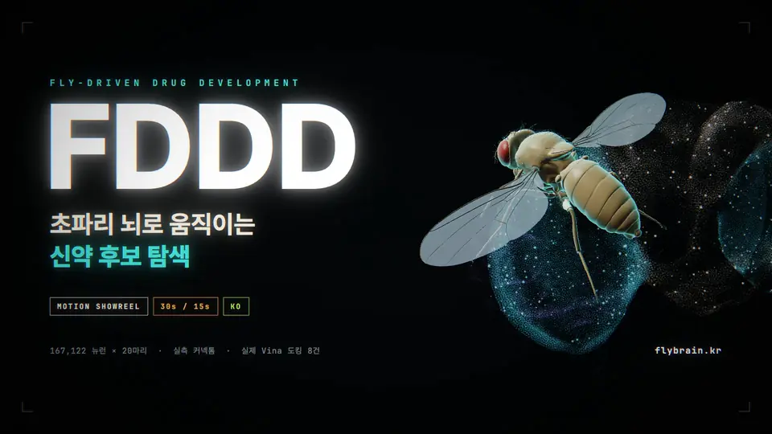
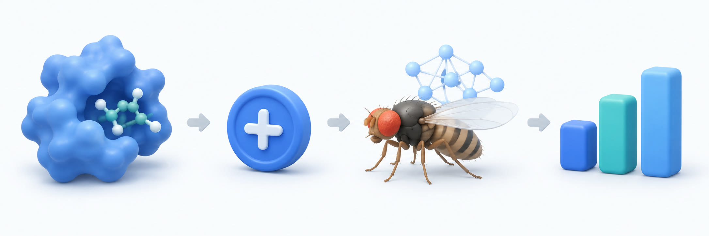

# FDDD · Fly-Driven Drug Development

<p align="center">
  <a href="https://flybrain.kr"></a>
</p>

[English](README.md) | **한국어**

**초파리 신경망 모델이 분자들 사이를 탐색하며, 도킹 점수에 따른 선호를 학습하는 과정을 브라우저에서 관찰하는 연구 데모입니다.**



**분자 도킹 → 보상 → 초파리 신경망 → 탐색·선호**

*이해를 돕기 위한 AI 생성 3D 개념도입니다. 실제 분자 구조, 신경 연결, 실험 결과를 나타내는 그림은 아닙니다.*

## 바로 체험하기

- **대표 사이트: https://flybrain.kr/**
- **동일한 데모의 다른 주소: https://drug.flybrain.kr/**
- **영어 페이지: https://flybrain.kr/en** · 화면 오른쪽 위 `KO | EN`으로도 전환할 수 있습니다.

설치나 로그인 없이 열 수 있습니다. 초기 데이터 로딩이 끝나면 자동으로 시작합니다. 신경망 계산은 서버가 아니라 **방문자의 브라우저 안에서** 실행됩니다.

## 어떤 페이지인가요?

화면에는 단백질과 작은 분자, 그리고 그 사이를 날아다니는 가상 초파리들이 있습니다. 파리마다 실제 초파리의 신경 연결 지도인 **MaleCNS**를 바탕으로 만든 독립적인 신경망 모델이 하나씩 실행됩니다. 신경 연결 지도는 어떤 신경세포가 서로 연결되어 있는지를 기록한 데이터입니다.

분자 도킹은 **작은 분자가 단백질에 어떤 자세로 들어맞을지 계산하는 방법**입니다. FDDD는 미리 실행한 AutoDock Vina 도킹 결과를 읽고, 그 점수를 보상으로 바꾸어 파리의 후보별 선호를 갱신합니다. 방문자는 파리가 어디로 이동하고 얼마나 머무는지, 그동안 신경 활동과 선호가 어떻게 달라지는지 함께 볼 수 있습니다.

> 쉽게 말하면, **분자 도킹 결과를 가상 초파리의 탐색과 학습으로 표현한 실험 공간**입니다. 실제 초파리에게 약을 먹이는 실험이나, 신약의 효과를 입증하는 서비스는 아닙니다.

## 처음에는 이렇게 보세요

1. **관측실(Observatory)**의 큰 뇌부터 보세요. 실측 뉴런 위치 위의 민트빛 점은 선택한 개체의 계산된 스파이크를 보여줍니다. 드래그로 관찰 시점을 회전할 수 있습니다.
2. **도킹 → 보상 → 뇌 계산 → 탐색 → 선호 학습** 단계를 눌러 보세요. 계산값과 설계된 규칙을 구분해서 설명하고, 해당 단계의 값을 함께 보여줍니다.
3. **단백질별로 후보를 선택**하면 실제 도킹 자세가 열립니다. `Mol*에서 자세히 보기(Inspect in Mol*)`로 구조를 살펴보거나 `탐색 서식지(Living habitat)`로 돌아가 개체들의 이동을 관찰하세요. `추적(Follow)`은 선택한 개체를 따라갑니다.
4. **도킹 점수, 학습된 선호, 체류율을 구분**해 보세요. 각각 실행된 Vina 점수, 개체의 학습값, 최근 3분 동안 후보 근처에 머문 시간의 비율입니다.
5. **학습(Learning)**을 끄면 선호값의 갱신만 멈추고 뇌 계산과 이동은 계속됩니다. `일시정지(Pause)`는 시뮬레이션 전체를 멈춥니다. 아래 뇌 타일을 선택하면 해당 개체를 자세히 볼 수 있습니다.
6. **쇼릴 보기(Watch the film)**에서 영어 15초·30초 영상을 재생하고, **방법·출처·한계(Methods, sources & limits)**에서 사용한 데이터와 해석 범위를 확인하세요.

**느리다면:** `개체 수(Brains)`를 4로 낮추고 탭 하나만 열어 두세요. 4·8·12·20마리 중 선택할 수 있으며, 기본값은 기기 성능에 따라 정해집니다. 마릿수를 바꾸면 확인창을 거쳐 새 세션이 시작되며, 일시정지와 학습 설정은 유지합니다. 여러 신경망을 동시에 계산하므로 데스크톱 브라우저를 권장합니다.

## 어떻게 작동하나요?

```text
미리 실행한 분자 도킹 결과
           ↓
점수를 보상으로 변환 → 접촉한 후보의 선호값 갱신
           ↓
미각 신경 입력에 보상 전달 + 개체별 신경망 계산
           ↓
계산된 운동 출력 + 설계된 이동·체류 규칙
           ↓
다음 후보 탐색, 신경 활동과 체류 분포 표시
```

보상이 높은 후보를 더 선호하도록 설계했지만 한 후보에만 모이게 하지는 않습니다. 학습한 값에 비례해 다음 목적지를 선택하며 일부 탐색을 유지합니다. 짧은 실행에서 체류 순위가 도킹 점수 순위와 정확히 일치할 필요는 없습니다.

## 실제 데이터와 설계된 규칙의 구분

| 구분 | 현재 구현 |
| --- | --- |
| **신경 연결 데이터** | MaleCNS v1.0의 한 수컷 초파리에서 얻은 뇌 + 복측신경삭(VNC) 연결 데이터 사용 |
| **개체별 신경망 계산** | 선택된 **167,122개 뉴런**, **6,241,236개 방향성 연결**을 개체마다 독립적으로 계산. 연결당 시냅스가 5개 이상인 경우만 포함 |
| **뇌 시각화** | 측정된 세포체 위치 **28,195개**로 활동을 표시. 그림은 표본이지만 계산은 선택된 전체 뉴런을 대상으로 수행 |
| **분자 구조와 도킹** | 단백질 3종, 분자 6종의 **실제로 실행한 8개 조합**. 실험 구조와 계산된 결합 자세를 표시 |
| **보상 입력** | 보상을 MaleCNS에서 미각으로 분류된 **1,428개 뉴런**에 입력. 입력 방식과 크기는 설계한 규칙 |
| **학습과 움직임** | 도킹 점수의 보상 변환, 후보 선호 갱신, 비행·체류 규칙은 개발자가 설계. 신경망의 계산 결과가 움직임에 영향을 줌 |

**해석할 때 주의할 점**

- 도킹 점수는 실험으로 측정한 결합 친화도나 약효가 아닙니다. 서로 다른 단백질의 원점수를 임상적 우열로 비교할 수 없습니다.
- 파리는 이미 계산된 점수에서 만든 보상으로 학습합니다. 신경망이 결합력을 독립적으로 발견하거나 새 약물을 검증한 것이 아닙니다.
- 실제 연결 데이터를 사용하지만 신경세포 동역학, 감각·운동 변환, 선호 학습은 단순화한 모델입니다. 생물학적 시냅스 가소성이나 실제 초파리 행동을 재현했다고 주장하지 않습니다.
- **167,122는 공식적으로 추적 완료된 뉴런 수가 아닙니다.** `Traced` 165,122개에 추가 선택 2,000개를 포함한 모델 범위입니다. 추가분 중 1,991개는 원자료에서 `Out of scope`로 표시되어 있습니다. 전체 원본 그래프를 필터 없이 사용하는 것도 아닙니다. [선택 기준과 출처](public/data/malecns/NOTICE.md)
- 파리 아바타는 시각적 표현이며 분자와 실제 물리적 축척이 같지 않습니다.

## 공개 사이트와 데이터 저장

두 도메인은 **같은 정적 웹 데모**를 제공합니다. 공개 사이트는 신경망을 브라우저에서 계산하고, 이미 실행된 도킹 결과를 보여 줍니다. 서버에서 새 도킹을 실행하거나 모델을 재학습하지 않습니다.

신경 활동 기록은 서버로 업로드되지 않고 해당 브라우저의 IndexedDB에 저장됩니다. 공개판은 원시 스파이크 데이터 **500 MB**까지 기록하며, 한도에 도달하면 기록만 멈추고 계산과 표시는 계속합니다. **새 세션이 시작되면 이전 세션의 기록은 자동 삭제됩니다.** 공개판에는 프로젝트 폴더로 기록을 저장하는 기능이 없습니다.

## 내 컴퓨터에서 실행하기

Node.js 22 이상을 권장합니다.

```sh
git clone https://github.com/AwesomeZun/FDDD.git
cd FDDD
npm ci
npm run build
npm run serve
```

http://localhost:5177/ 을 엽니다. 기본 데모에 필요한 MaleCNS 데이터와 실행된 도킹 결과는 저장소에 포함되어 있습니다.

```sh
npm test            # 테스트
npm run typecheck   # 타입 검사
```

로컬 서버에서는 `세션(Session)` → `프로젝트에 기록 저장(Save records to project)`으로 현재 세션 기록을 `public/data/records/`에 저장할 수 있습니다. 보관하려면 새로고침 전에 저장하세요. 브라우저 Downloads 폴더는 사용하지 않습니다. 로컬판은 공개판의 500 MB 제한이 없으므로 저장 공간에 주의하세요.

원본 대용량 데이터(`upstream/`), 백업, 세션 기록, 과거 FlyWire 데이터, 원시 학습 스파이크 파일, 로컬 도킹 도구(`.tools/`)는 GitHub에 포함하지 않습니다. **데모 실행과 도킹 재실행은 다릅니다.** 도킹을 다시 실행하려면 별도 도구 준비가 필요합니다.

## 인터페이스 v2.0.0

현재 화면은 영어가 기본인 **Neural Observatory**입니다. 한국어는 `/ko`에서 사용할 수 있습니다. 화면 밖의 3D 장면은 그리기를 쉬지만 신경망 계산은 계속됩니다.

- [새 인터페이스와 검증 기록](docs/platform-v2.0.0.md)
- [보존한 v1.0.0 소스](versions/platform/v1.0.0/manifest.json)

## 더 알아보기

- [도킹 조합, 방법 및 재현](docs/multi-target-docking.md)
- [보상 입력과 선호 학습: 변경 이력 포함](docs/brain-reward-loop.md)
- [MaleCNS 출처·선택 범위·모델 한계](public/data/malecns/NOTICE.md)
- [MaleCNS 데이터 명세](public/data/malecns/manifest.json)
- [공개 배포 구성과 제약: 배포 이력 포함](docs/public-deploy.md)

세부 문서에는 이전 구현의 실험 기록도 포함되어 있습니다. 현재 데모의 개요는 이 README를 기준으로 보세요.

## 출처와 라이선스

MaleCNS 데이터는 FlyEM / HHMI Janelia, University of Cambridge, MRC Laboratory of Molecular Biology, Google Research의 자료이며 **CC BY 4.0** 조건을 따릅니다. 분자 도킹에는 AutoDock Vina / Webina, 구조 뷰어에는 Mol*를 사용합니다.

코드, 데이터, 도구의 라이선스는 각각 다릅니다. 재사용할 때 [LICENSE](LICENSE), [THIRD_PARTY_NOTICES.md](THIRD_PARTY_NOTICES.md), 각 데이터의 출처·라이선스를 확인하고 유지해 주세요.

Built with [fly-connectome-template](https://github.com/cobanov/fly-connectome-template) by [Mert Cobanov](https://github.com/cobanov).
