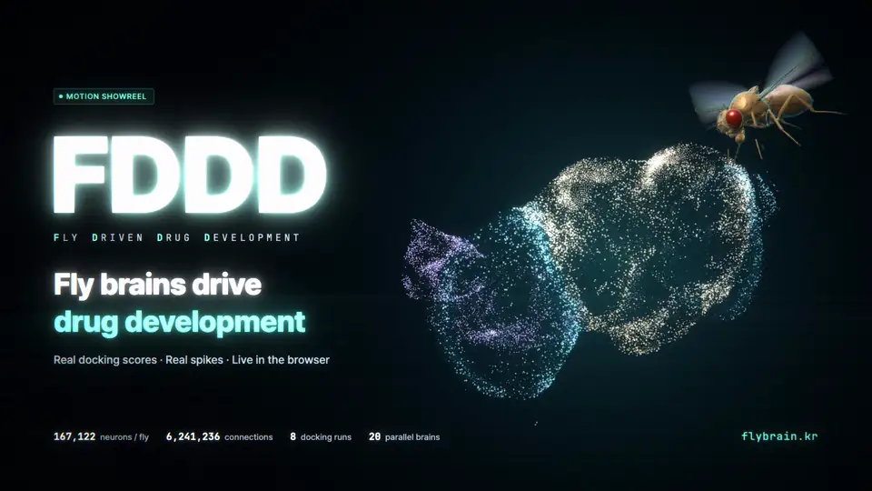

# FDDD · Fly-Driven Drug Development

<p align="center">
  <a href="https://flybrain.kr/en"></a>
</p>

**English** | [한국어](README.ko.md)

**A browser-based research demo where fruit-fly neural models explore molecules and learn preferences from molecular docking scores.**


**Molecular docking → Reward → Fruit-fly neural model → Exploration & preference**

*AI-generated 3D concept illustration for explanation only. It does not depict actual molecular structures, neural connectivity, or experimental results.*

## Try it live

- **Main site (English): https://flybrain.kr/en**
- **Alternative address for the same demo: https://drug.flybrain.kr/en**
- **Korean:** Select `KO` in the language switcher at the top right.

No installation or login is needed. The demo starts automatically after loading its data. Neural computation runs **in your browser**, not on a server.

## What am I looking at?

The scene contains proteins, small molecules, and virtual fruit flies moving among them. Each fly runs an independent neural model based on **MaleCNS**, a measured map of connections between fruit-fly neurons.

Molecular docking is **a computational method for estimating how a small molecule might fit into a protein**. FDDD loads results from completed AutoDock Vina runs, converts the scores into rewards, and updates each fly's preference for the candidates it visits. You can watch where the flies go, how long they stay, and how their neural activity and preferences change.

> This is **an experimental space that turns docking results into virtual fly exploration and learning**. It is not an experiment that gives drugs to living flies, or a service that proves a drug works.

## A quick tour

1. **Start in the Observatory.** The large brain uses measured neuron locations; its mint flashes follow the selected fly's computed spikes. Drag to rotate the view. The trace shows that individual's observed activity.
2. **Follow the signal.** Walk through Dock → Reward → Compute → Explore → Learn. Each step explains what is calculated and what is an authored rule, alongside a live value.
3. **Explore the experiment.** Filter by protein and select a candidate to see its actual docking pose. Use **`Inspect in Mol*`** for detailed inspection, or **`Living habitat`** to watch the flies. `Follow` tracks the selected individual.
4. **Compare score, preference, and residence.** These are separate measures: executed Vina score, an individual's learned value, and the colony's observed near-candidate time over the last three minutes.
5. **Control the experiment.** `Learning off` freezes preference updates while neural computation and movement continue. `Pause` stops the simulation. Click any colony tile to inspect that individual.
6. **Open `Watch the film`** for the English 15-second and 30-second showreels, or **`Methods, sources & limits`** for data provenance and model boundaries.

**If it runs slowly:** Set `Brains` to 4 and keep only one demo tab open. Options are 4, 8, 12, and 20 flies; the default is chosen for your device. Changing the count opens a confirmation before replacing the session; pause and learning settings are retained. A desktop browser is recommended because several neural models run at once.

## How does it work?

```text
Previously executed molecular docking results
                    ↓
Convert scores into rewards → update preference for the contacted candidate
                    ↓
Send reward to gustatory inputs + compute each fly's neural model
                    ↓
Computed motor output + authored movement and residence rules
                    ↓
Explore the next candidate; display activity and residence distribution
```

The policy favors higher-reward candidates without sending every fly to just one candidate. It selects destinations in proportion to learned values while retaining some exploration. Residence rankings in a short run need not match the docking-score rankings exactly.

## What is measured, computed, or designed?

| Component | Current implementation |
| --- | --- |
| **Connectivity data** | MaleCNS v1.0 brain and ventral nerve cord (VNC) connectivity from a single male fruit fly |
| **Neural computation per fly** | **167,122 selected neurons** and **6,241,236 directed connections**, computed independently for each fly. Only connections with at least 5 synapses are retained |
| **Brain visualization** | Activity displayed at **28,195 measured soma locations**. The picture uses a sample; computation covers the entire selected neuron population |
| **Structures and docking** | **8 executed combinations** involving 3 proteins and 6 distinct molecules. Experimental structures and computed docking poses are shown |
| **Reward input** | Reward is sent to **1,428 neurons** annotated as gustatory in MaleCNS. The input mapping and strength are authored rules |
| **Learning and movement** | Score-to-reward conversion, candidate preference updates, and flight/residence rules are engineered. Computed neural output influences movement |

**Important limits**

- Docking scores are not experimentally measured binding affinities or drug efficacy. Raw scores across different proteins do not establish clinical superiority.
- The flies learn from rewards derived from known docking results. The neural model does not independently discover binding strength or validate new drugs.
- The connectivity is measured, but neural dynamics, sensory/motor mappings, and preference learning are simplified models. This is not a claim of biological synaptic plasticity or validated fruit-fly behavior.
- **167,122 is not the officially traced neuron count.** It includes 165,122 `Traced` neurons plus 2,000 additional selected rows. Of those additions, 1,991 are labeled `Out of scope` in the source. This is a selected, filtered model, not the complete unfiltered source graph. [Selection and provenance](public/data/malecns/NOTICE.md)
- Fly avatars are visual representations and are not on the same physical scale as the molecules.

## Public sites and recording

Both domains serve **the same static web demo**. The public site computes neural activity in the browser and displays completed docking results. It does not run new docking jobs or retrain models on a server.

Neural recordings are not uploaded. They remain in that browser's IndexedDB. The public build records up to **500 MB of raw spike data**; after that, recording stops but computation and display continue. **Starting a new session automatically deletes previous-session recordings.** The public build cannot save recordings into a project folder.

## Run locally

Node.js 22 or later is recommended.

```sh
git clone https://github.com/AwesomeZun/FDDD.git
cd FDDD
npm ci
npm run build
npm run serve
```

Open http://localhost:5177/. The repository includes the MaleCNS runtime data and completed docking results needed for the basic demo.

```sh
npm test            # Run tests (two legacy suites require excluded local fixtures)
npm run typecheck   # Check types
```

On the local server, open `Session` → `Save records to project` to save current-session recordings under `public/data/records/`. Save before reloading if you want to keep them. The browser Downloads folder is not used. The local build does not have the public build's 500 MB cap, so watch disk usage.

Large raw data (`upstream/`), backups, session recordings, archived FlyWire data, raw training spikes, and local docking tools (`.tools/`) are not included on GitHub. **Running the demo is different from rerunning docking.** New docking runs require separate tool setup.

## Interface v2.0.0

The current interface is the **Neural Observatory**: a cinematic, English-first laboratory with live neural rendering, a five-step explanation, an integrated molecular workbench, and an independent-brain colony view. Korean remains available at `/ko`. Rendering pauses for offscreen 3D panels while the simulation continues.

- [Interface release and validation](docs/platform-v2.0.0.md)
- [Preserved v1.0.0 source](versions/platform/v1.0.0/manifest.json)
- Browser QA: after `npm run build` and `npm run preview -- --port 4173`, run `npm run qa:platform`. Install Playwright Chromium or set `CHROME_PATH` to an installed browser. Results and screenshots are written to a new temporary directory.

## Showreel

The English motion showreel is available in **15-second and 30-second cuts**, with a self-contained HTML player, 1080p/60 fps MP4 masters, lightweight sharing copies, and cover images. The animated preview above uses the English 15-second cut.

See [the showreel guide](showreel/README.md) for local playback, build instructions, data provenance, and the distinction between computed results and animation. The Korean v1.0.0 assets are preserved.

## Further reading

- [Docking combinations, methods, and reproduction](docs/multi-target-docking.md)
- [Reward input and preference learning, including change history](docs/brain-reward-loop.md)
- [MaleCNS provenance, selection, and model limits](public/data/malecns/NOTICE.md)
- [MaleCNS data manifest](public/data/malecns/manifest.json)
- [Public deployment configuration and limits, including deployment history](docs/public-deploy.md)

Detailed documents also contain experiments from earlier implementations. Use this README for an overview of the current demo.

## Credits and licenses

MaleCNS data comes from FlyEM / HHMI Janelia, the University of Cambridge, the MRC Laboratory of Molecular Biology, and Google Research, under **CC BY 4.0**. Molecular docking uses AutoDock Vina / Webina; detailed structure viewing uses Mol*.

Code, data, and tools have separate licenses. Before reuse, review and preserve [LICENSE](LICENSE), [THIRD_PARTY_NOTICES.md](THIRD_PARTY_NOTICES.md), and the notices accompanying each dataset.

Built with [fly-connectome-template](https://github.com/cobanov/fly-connectome-template) by [Mert Cobanov](https://github.com/cobanov).
