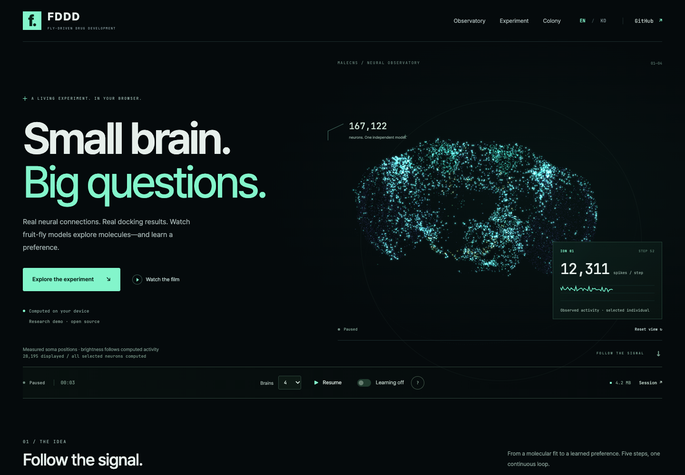
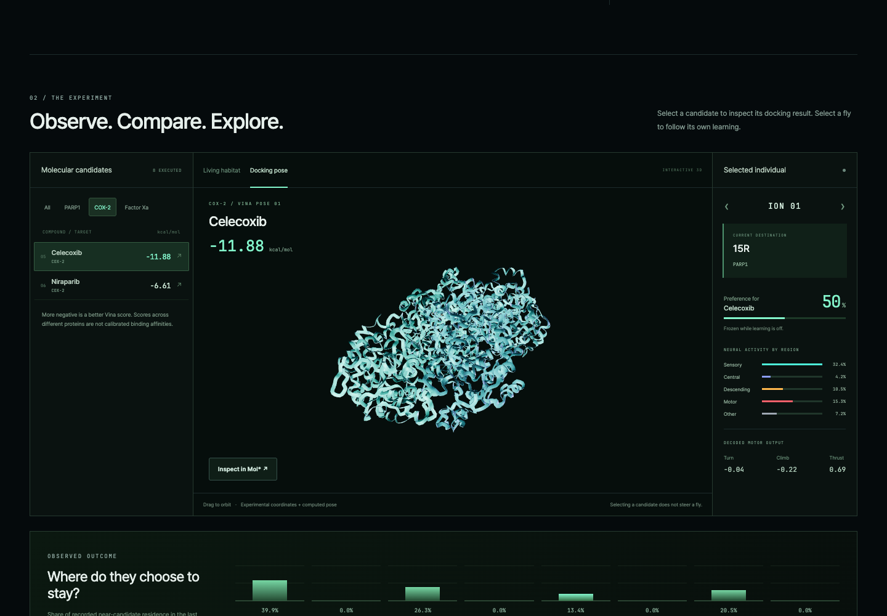

# FDDD · Neural Observatory v2.0.0

An English-first research laboratory with a dark cinematic interface, mint neural activity, and a clear path from molecular docking to learned preference.



## Experience

- **Observatory:** measured MaleCNS soma positions, live spikes for the selected individual, a bounded activity trace, and direct experiment controls.
- **Follow the signal:** five keyboard-accessible steps explain docking, reward, neural computation, exploration, and learning. Each step includes an actual value and identifies authored rules.
- **Experiment:** protein filters, eight executed docking results, a large molecular pose view, Mol* inspection, the shared habitat, and selected-individual readouts.
- **Observed outcome:** actual near-candidate residence over the rolling three-minute window. No fabricated ranking or seeded chart.
- **Colony:** independent neural models, selectable brain tiles, and a synchronized selected individual.
- **Methods and session:** data provenance, model boundaries, local recording/export behavior, and confirmation before replacing a session.
- **Film:** the existing English v1.1.0 showreel, with 15-second and 30-second cuts, loads on demand.



## Controls and language

`Learning off` freezes candidate preference updates. Neural activity, reward inputs, and movement continue. `Pause` stops the simulation. Changing brain count replaces the session after confirmation and retains pause/learning settings. Counts remain 4, 8, 12, or 20, chosen initially for the device.

English is the default. `/en` and `/ko` explicitly select a language; the language switcher preserves an intentional choice for the root route. Korean browser locale alone does not override the English default.

Responsive layouts were checked at 1440, 1024, 768, 390, and 320 CSS pixels. Native modal dialogs support Escape and restore focus. Automatic camera rotation honors reduced motion; offscreen 3D panels suspend rendering while computation continues.

## Scientific scope

The engine, connectome, sensory encoding, learning policy, molecular coordinate transform, and executed docking results are unchanged. Each fly computes 167,122 selected neurons and 6,241,236 directed connections; the main view displays the existing sample of 28,195 measured soma positions. Spike glow comes from the selected live frame. Viewing motion and glow decay are display effects.

Docking scores, authored rewards, learned preference values, and observed residence are distinct. Cross-target Vina scores are not calibrated binding affinities. This remains a research demonstration, without a claim of validated fly behavior or drug efficacy.

## Validation

- `npm run build`: TypeScript and Vite production build pass. Mol* and existing Three.js modules still produce chunk-size advisories; detailed Mol* inspection loads on demand.
- `npm run qa:platform`: **20 browser scenarios passed** in Chrome 154, with no uncaught page errors or failed runtime data requests. [Recorded result](platform-qa-v2.0.0.json)
- Actual four-brain and eight-brain computation verified, including pause, resume, exact preference freeze, candidate filtering, molecular structures, individual selection, both showreel cut controls, language switching, keyboard tabs, dialog focus, and session replacement.
- `npm test`: **44 passed; 2 could not run because excluded legacy fixtures are absent.** `flight.test.ts` requires the archived FlyWire graph; `docking-evidence.test.ts` requires original Vina `.log` files. Neither test nor its missing data is changed by this release. These are not counted as passes.
- The built font subset is renamed **FDDD Lab Sans** to respect Pretendard's reserved names. Both local fonts retain their OFL notices.

To repeat browser QA:

```sh
npm run build
npm run preview -- --port 4173
# In a second terminal; install Chromium with `npx playwright install chromium` if needed:
npm run qa:platform
```

`BASE_URL`, `CHROME_PATH`, and `QA_OUTPUT` can be set for another preview server, installed browser, or output directory. Tests use real runtime data, isolated browser storage, and a four-brain starting colony. Viewport checks verify layout in desktop Chrome; they are not a benchmark on a physical phone.

## Preservation and implementation

- [v1.0.0 archive manifest](../versions/platform/v1.0.0/manifest.json) records the original commit and SHA-256 of the preserved platform source. Shared datasets remain in `public/data`.
- New interface source lives in `src/platform/v2.0.0/`.
- Previous English and Korean README versions remain beside the updated v2.0.0 entries.
- The earlier showreel assets remain unchanged; the public player is copied to `public/showreel/v1.1.0/index.html`.

[Mobile view](assets/platform-mobile-v2.0.0.png)
