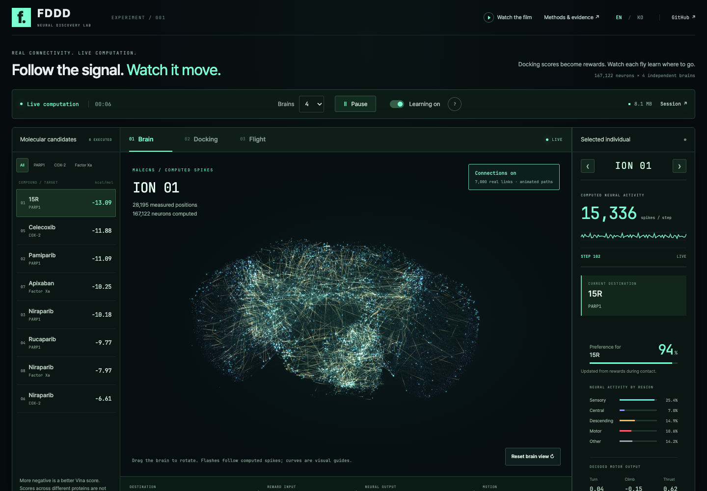
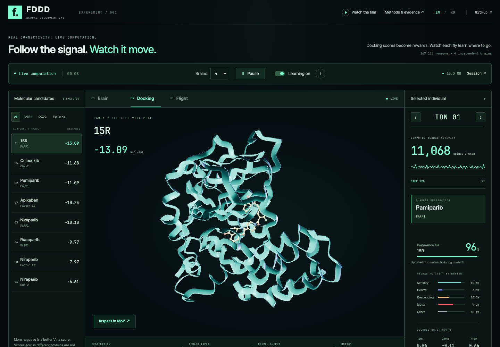

# FDDD · Neural Discovery Lab v3.0.0

The laboratory opens directly into a live experiment. A large central stage connects **Brain**, **Docking**, and **Flight**, with molecular candidates on the left and the selected individual's activity, destination, preference, and motor readouts on the right. The control bar is visible before the experiment.

## Connected observation

- **Brain:** measured soma locations, computed spikes, and 7,000 sampled real directed connections. Drag to rotate; turn connections off to inspect the point cloud alone.
- **Docking:** executed Vina poses from the selected candidate, with the detailed Mol* inspector available directly from the scene.
- **Flight:** a close camera follows the selected individual. Switch to the shared habitat or reset the camera to see the colony. Position, trail, destination, and speed come from the running simulation.
- **Readouts:** destination → actual reward input → computed spike count → actual movement. Selecting an individual updates its trace, neural display, preference, and flight tracking together.
- **Colony and explanation:** selectable independent brains, observed residence, and an expandable five-step explanation appear below the main experiment.

## Startup and recording reliability

The previous recording initializer tried to delete the shared IndexedDB database. With a second tab open, the delete became blocked but remained queued; later database opens waited indefinitely. That could prevent neural startup without displaying an error. This was reproduced with the first tab ready and the second still unready after a blocked delete event.

The initializer no longer deletes the database. Each live session holds its own Web Lock. Cleanup only removes inactive, tracked sessions in bounded background transactions; other active tabs and legacy records are preserved. Browser storage opens are bounded. Recording denial, blocked storage, or quota exhaustion disables recording and displays a notice while computation, learning, and movement continue. Worker requests and graph downloads also have timeouts, and startup displays actual initialized-brain progress and recovery controls.

The public recording cap remains 500 MB. Full spike recording and local project-folder export retain their existing format. Unrecorded frames are counted. Neural computation does not depend on a successfully opened recording database.

## Scientific display boundaries

Each individual still computes 167,122 selected MaleCNS neurons and 6,241,236 directed edges; 28,195 measured soma locations are displayed. The new link asset samples 7,000 actual directed pairs whose endpoints are in that display, emphasizing longer connections with at least 20 signed-count magnitude. It is a visual sample, not a representative statistical estimate.

The reproducible builder is `scripts/build-display-connections.py`. The asset records hashes of its source graph and display points. A regression test independently verifies every sampled endpoint and weight against the graph. Curved paths are viewing aids, not reconstructed neurites. Travelling light follows the source neuron's computed spike flag, with authored timing; it does not measure axonal conduction velocity. No prerecorded showreel spikes drive the dashboard.

Learning, steering, and reward rules retain their stated authored-model boundaries. Docking scores, preferences, and observed residence remain distinct. The platform does not validate drug efficacy.

## Validation

- `npm run build`: passes TypeScript and production build.
- `npm run qa:platform`: 27 browser scenarios passed against the production build, including actual WebGL drag, all observation modes, Mol*, EN/KO, responsive widths 320–1440, learning freeze, pause/resume, eight-brain restart, two simultaneous tabs plus reload, denied/blocked/quota-limited storage, and graph-download failure followed by successful restart. No uncaught page errors or missing runtime data in the normal path.
- `npm test`: 45 pass; 2 existing fixture-dependent tests cannot run because the excluded legacy FlyWire binary and original raw Vina logs are absent. These are not reported as passing.
- Mobile layouts were checked in desktop Chromium at mobile viewport sizes; this is not a physical-phone performance benchmark.

Run the same checks against a built preview with `BASE_URL=http://127.0.0.1:4173 npm run qa:platform`. Set `CHROME_PATH` when using an installed browser. Reports and screenshots go to `QA_OUTPUT` or a fresh temporary directory.

[Browser QA results](platform-qa-v3.0.0.json) · [Mobile view](assets/platform-mobile-v3.0.0.png)

## Preservation

The v2 source remains in `src/platform/v2.0.0/` and the [version archive](../versions/platform/v2.0.0/manifest.json). The new implementation is in `src/platform/v3.0.0/`. Versioned English/Korean READMEs preserve both releases. The English v1.1.0 showreel remains available unchanged. [Automatic team mirroring has been retired](mirror-sync.v2.0.0.md).
